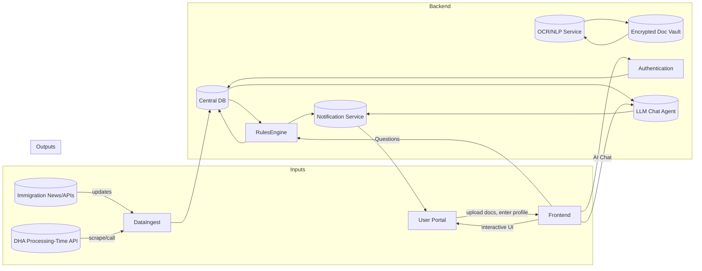

# Executive Summary  
The Australian visa-tech market is crowded with tools for points calculation, progress tracking and basic checklist management, but there are significant unmet needs. Major players include official government offerings (e.g. Home Affairs’ **myVEVO** status app and web-based points calculators), migration‐agent portals (e.g. Down Under Centre, VisaEnvoy) and consumer apps (e.g. **Visa Tracker Pro**, **VisaFlow AI**, Hazuu’s **Skilled/186 Visa Tracker**). Common features are points calculators, timeline trackers and static checklists. Gaps include personalised strategy planning, AI-driven guidance, document management and legal compliance reminders. Users on forums often report frustration with opaque processes, unresponsive agents and information overload. We identify 10+ novel feature ideas (Visa Strategy Agent, What-If simulators, Evidence Graphs, etc.) with clear value propositions, feasibility assessments (drawing on Home Affairs/APIs and LLMs) and monetisation models. We flag copyable features (points calculators, checklists) versus caution areas (legal advice, guaranteed outcomes) and outline compliance (privacy/APPs, encryption) steps. A technical plan is proposed using government data sources (Home Affairs API, SkillSelect data, processing-time APIs, IELTS/ACS sites) with OCR/NLP tools and a mermaid architecture diagram. Finally, we recommend three business models (freemium, subscription tiers, B2B licencing), key KPIs (active users, conversion rates, retention) and a 3-month MVP roadmap. This report provides a deep, actionable blueprint for differentiating an “AI Visa Helper” in Australia.

## 1. Market Inventory  

**Government Portals:** The Australian Department of Home Affairs provides official tools such as the *myVEVO* app (free, status tracker for visa details), an online Points Calculator (free) and a Document Checklist web tool (free). State governments publish nomination criteria but no consumer apps.  

**Major Apps/Websites:** Key private competitors include:  

- **Visa Tracker Pro** (iOS/Android) – A free app by a Canberra migration firm (Positive Thinkers) offering points calculators (189/190/491), SkillSelect EOI analytics, occupation search, visa pathway finder, document expiry tracker and visa fee calculator. Uses official data; includes news updates and state-nomination info. No ads or IAP (revenue via brand).  
- **Skilled Visa Tracker: 189/190/491** (iOS/Android) – Hazuu LLC’s free app (with ads/IAP) focusing on General Skilled Migration (189,190,491). Features include a full points test, live EOI queue data (official), timeline logging (milestones and push alerts), community-sourced processing times (crowdsourced grants), and grant predictions. Targets skilled migrants (with UX to compare with others).  
- **186 Visa Tracker: Australia** (iOS/Android) – Hazuu LLC’s free app (ads/IAP) for ENS 186 applicants. Community-driven timeline logging, percentile analytics, and forecasts for each stream. Users can browse anonymous real-case timelines and backlog insights.  
- **VisaFlow AI: Visa Checker** (Android) – A global immigration app (supports Aus, NZ, Canada, UK, US, Europe). Free with ads/IAP. Key features: AI-powered Q&A (“Visa Advisor”), multi-country visa eligibility quiz, point calculators (incl. Australian skilled points), customizable document checklists, visa journey tracker with reminders, and cost estimators. Claims privacy-first design.  
- **RouteToVisa: Immigration AI** (iOS) – Global immigration app (free+IAP) with AI chat guidance. Features include 24/7 AI immigration advisor, eligibility quiz (117+ routes, 21 countries), Australian points calculators with “what-if” scenario planning, visa pathway explorer (step-by-step guides), cost estimators, processing times, timeline generator, document checklist manager, and a community resource directory. Emphasizes local data (no cloud storage of cases).  
- **Pro Visa (Professional Visa & Education Services)** (iOS) – A free app by an Australian migration agency. Offers ANZSCO occupation search, visa fee calculator, live news feed, overseas health insurance info, and quick chat/consult features. Targets prospective migrants/ students; business model is lead-generation (30-min free consult).  
- **Migration Agent Websites:** Many registered agents (e.g. Down Under Centre, VisaEnvoy, ThisisAustralia) provide online tools. Typically free to the user (lead gen), offering a “points calculator” (e.g. VisaEnvoy’s 189/190/491 calculator) and info articles. Users enter their data and usually must provide contact info. These are SEO/marketing tools funneling to paid consultations (business model: agent fees).  

**Other Resources:**  
- **MyImmiTracker** (web) – Community platform where users log visa milestones. Consolidates processing statistics (by subclass, occupation etc.) from Australian and Canadian applicants. Free (no apparent fees); relies on user submissions.  
- **AustralianVisaTracker.com** (web) – Unofficial site scraping Home Affairs “Global Visa Processing Times” API. Shows historical and current processing-time charts for 70+ subclasses. Free.  
- **LawConnect AI Assistant** (web) – An AI chatbot for Australian immigration queries, provided by a legal matchmaking platform. Free (lead-gen), offers general immigration law information (via AI) and connects users to registered lawyers if needed. Not a visa planning tool per se, but relevant as an AI-guided info service.  

**Competitor Summary Table:** The table below summarises key offerings (note: focus on Aus PR/ skilled visas unless noted).  

| **Product**                | **URL**                         | **Model**            | **Target Users**            | **Key Features**                                              |
|----------------------------|---------------------------------|----------------------|-----------------------------|---------------------------------------------------------------|
| **myVEVO (Govt)**          | apps.apple.com/us/app/myvevo…  | Free (govt)          | Visa holders (all types)    | Visa status/expiry, conditions (work/study/travel) |
| **Points Calculator (Govt)** | immi.homeaffairs.gov.au        | Free (govt)          | Skilled visa applicants     | Online SkillSelect points estimator (189/190/491 subclass)      |
| **Document Checklist (Govt)** | immi.homeaffairs.gov.au       | Free (govt)          | Student visa applicants     | Generates required-doc list for student visa         |
| **Visa Tracker Pro**       | [App Store] / [Play] | Free (no ads)        | Skilled visa applicants     | Points calc, SkillSelect EOI ranking, occupation lookup, visa pathways, doc expiry tracking, VAC calc, news feed, English reqs |
| **Skilled Visa Tracker**   | (skilledvisatracker.com.au)    | Free, ads/IAP        | 189/190/491 visa applicants | Points test, EOI queue data, visa timeline logging, community grants feed, analytics/predictions |
| **186 Visa Tracker**       | (hazuu.com / app)              | Free, ads/IAP        | ENS subclass 186 applicants | Timeline milestones log, community timelines, processing analytics by stream |
| **VisaFlow AI**            | Google Play      | Free, ads/IAP        | Global visa seekers (incl. AU) | AI visa advisor, eligibility quiz, multi-country support, doc checklists, journey tracker, reminders, cost estimator, educational info |
| **RouteToVisa**            | (routetovisa.com) iOS | Freemium (IAP)       | Global visa seekers         | AI immigration advisor, eligibility quiz, Aussie points “what-if”, pathway guides, timeline planner, cost & docs checklists, community links |
| **Pro Visa**               | apps.apple.com/us/app/pro-visa | Free (agent app)     | Prospective migrants/students | ANZSCO search, visa fee calculator, immigration news, health insurance info; agent chat/consult booking |
| **Down Under Centre**      | downundercentre.com (web)      | Free (lead-gen)      | Skilled visa hopefuls       | Online points calculator for 189/190/491 (form)        |
| **VisaEnvoy Points Calc**  | visaenvoy.com (web)  | Free (lead-gen)      | Skilled visa hopefuls       | Web points calculator (189/190/491)                  |
| **ThisisAustralia (Agent)** | thisisaustralia.com.au        | Free (lead-gen)      | All visa types              | Info content, points calculator, consultation booking           |
| **MyImmiTracker (Web)**    | myimmitracker.com              | Free (community)     | Visa applicants (AU/CA)     | Visa timeline trackers, backlog stats by subclass        |
| **AustralianVisaTracker**  | australianvisatracker.com      | Free (community)     | Visa applicants             | Interactive processing-time charts (70+ subclasses)  |
| **LawConnect AI**          | lawconnect.com                 | Free (AI Q&A)        | Anyone with immigration queries | AI-based immigration info (non-legal advice), connects to lawyers |

## 2. Feature Analysis  

We extracted and categorized features from these competitors. Common offerings (present in multiple products) include **Points Calculators**, **Visa/EOI queue trackers**, **Basic Checklists**, and **News updates**. Rare or unique features include advanced AI assistants, document vaults, autofill, and analytic tools. The matrix below indicates feature presence (✔) or absence (–) across key products:  

| **Feature**                | **Govt Tools** | **VisaTracker Pro** | **Skilled/186 Tracker (Hazuu)** | **VisaFlow AI** | **RouteToVisa** | **Agent Sites** | **LawConnect AI** |
|----------------------------|:--------------:|:-------------------:|:-------------------------------:|:--------------:|:--------------:|:---------------:|:-----------------:|
| Points Calculator (189/190/491) | ✔ (web)  | ✔          | ✔            | ✔              | ✔ | ✔ (site forms)   | –                 |
| Visa Status/Tracker (conditions/expiry) | ✔ (myVEVO app) | –       | –                       | –              | –              | –               | –                 |
| Case Timeline Tracking     | –              | ✔ (doc expiry alerts) | ✔ (milestone logging) | ✔ (journey tracker) | ✔ (timeline planner) | –               | –                 |
| EOI Queue/Analytics        | –              | ✔ (EOI rank)    | ✔ (live EOI data)    | –              | –              | –               | –                 |
| Occupation Search (ANZSCO) | –              | ✔          | ✔ (points calc uses lists)   | –              | –              | –               | –                 |
| Visa Pathway Suggestion    | –              | ✔ (pathfinder)  | –                       | –              | –              | –               | ✔ (AI Q&A)        |
| Document Checklist Generator | ✔ (student visa only) | –         | –                       | ✔ (custom checklists) | ✔ (docs checklist) | –           | –                 |
| Document Vault/Storage     | –              | –                 | –                       | –              | –              | –               | –                 |
| Form Autofill (PDF)        | –              | –                 | –                       | –              | –              | –               | –                 |
| Visa Processing Times (global) | ✔ (statistical data) | –       | –                       | –              | –              | –               | –                 |
| Visa Fee/Cost Calculator   | –              | ✔ (VAC)     | –                       | –              | –              | ✔ (often on agent site) | –         |
| AI-Powered Assistance (chat) | –             | –                 | –                       | ✔ (AI advisor)   | ✔ (AI advisor) | –               | ✔ (AI Q&A)        |
| Application “What-If” (scenario planning) | – | –           | –                       | –              | ✔ (points what-if) | – | – |
| News & Updates Feed        | –              | ✔                | –                       | ✔ (info)         | –              | ✔ (blogs/news)   | –                 |
| Community Data Sharing     | –              | –                 | ✔ (shared timelines) | –              | –              | –               | –                 |
| Privacy-First (local data) | ✔ (govt ethos) | ✔ (no tracking)   | ✔ (opt-in sharing)        | ✔               | ✔               | –               | ✔ (no log)        |

**Legend:** ✔ = Available; – = Not available.  

**Common Features:** Points calculators (official or app-based) and visa timeline trackers dominate. VisaTracker Pro and Hazuu’s apps exemplify these: both include points tests and allow users to log milestones and compare with statistics. Document checklists are typically static or built into forms (Home Affairs provides a student visa checklist tool) rather than intelligent generators. News feeds and simple reminders (expiry alerts, processing times) appear in several apps, but none personalize beyond general notifications.  

**Rare/Unique Features:** AI-driven guidance (as seen in VisaFlow and RouteToVisa) is still uncommon. These apps offer AI chat and scenario planning (“what-if”) to explore visa pathways. Document management (upload/vault) and form autofill are virtually absent, despite being frequently requested by users. Advanced analytics (e.g. Evidence Graphs linking docs to criteria, Readiness Scores, consistency checkers) do not exist in current products. Likewise, family planning (calculating combined points or parallel visa tracks for partners/kids) is unaddressed.  

This analysis highlights that while many tools copy core features (points, timelines), truly differentiating features (AI strategy agents, interactive simulators, smart documentation) are rare or unique. The competitor matrix above will guide our gap identification.

## 3. User Pain Points & Gaps  

User feedback (from forums, reviews, social media) reveals consistent frustrations and unmet needs:

- **Lack of Transparency/Feedback:** Visa applicants complain about opaque processing times and unanswered status queries. They often must “constantly refresh ImmiAccount” with no clear milestones. Community tools (MyImmiTracker, 186 Tracker) are lauded for filling this gap, implying demand for better real-time tracking.

- **Information Overload & Complexity:** Many users find official guidance confusing and scattered across multiple sites. They struggle to identify which visa suits them or which documents are needed. Migration agents try to help but are often seen as *“selling a dream”* or providing inconsistent advice. Users express anxiety that agents prioritize profit over clarity.

- **Cost & Accessibility of Advice:** Personal stories reveal applicants frustrated by high agent fees and delays. Several report doing DIY after poor agent experiences: “I wasted DAYS … [on] the same [simple] application” and now recommend handling forms themselves. This suggests a gap for affordable self-service guidance (e.g. AI or DIY checkers). LawConnect and chatbots provide some free info, but many seek more integrated help with process details.

- **Document Management Pain:** Although no direct quotes were found, it is logical that applicants find gathering and verifying documents tedious. Current solutions offer at best static lists; users have voiced (especially on Facebook groups) concerns about data privacy on tracker apps – indicating they *do* share info but worry about security. A safe document vault with reminders could alleviate stress.

- **Personalisation Needs:** Users want tailored advice (e.g. “Which state should I apply to?”, “How can I improve my points?”). The generic news feeds and static calculators fail to translate policy changes into personal impact. For example, when visa rules change, people wonder “What does this mean for me?” but must interpret it themselves. An automated “news-impact alert” (explaining effects on the user’s profile) is not offered by current products.

**Prioritised Gaps (by frequency/impact):** 1) **Visa Strategy Guidance:** Users frequently ask on forums which visa to pick and how to boost chances, indicating a need for scenario planning and second opinions. 2) **Document & Deadline Management:** Complaints about missed documents or deadlines suggest a need for smart checklists and reminders (not just static lists). 3) **Real-time Tracking & Predictions:** The popularity of community trackers shows demand for personalized status prediction. 4) **Cost Transparency:** Few tools let users simulate total costs (fees, exams, relocation). This often comes up as anxiety about “hidden expenses.” 5) **Trustworthy Advice:** Skepticism of agents and machine-generated rumors highlights a gap for a reliable, transparent advisor (e.g. AI assistant clearly citing sources).  

These gaps form the basis for our differentiation: features like an AI Visa Advisor, Evidence Graph for docs, Readiness Score and personalized alerts directly address them.

## 4. Differentiation Opportunities  

We propose **10+ unique, defensible features** (technical or product) beyond the common set. For each we outline the value, feasibility, complexity and monetization strategy:

- **Visa Strategy Agent** – **Value:** Recommends personalized visa pathways by comparing user profile against all visa classes. Considers qualifications, occupation, family. Helps choose between skilled, partner, business, etc. **Feasibility:** Needs rules from Home Affairs visa listings (e.g. mapping occupations to eligible visas) and user data. Can leverage LLM with up-to-date policy text. **Complexity:** *Medium*. Data is available, but coding logic (or LLM prompt design) is non-trivial. **Monetization:** Premium tier or pay-per-strategy report. Users likely to pay for expert advice.  

- **What-If Simulator** – **Value:** Allows “what if I improve X?” scenarios. E.g. change IELTS scores, work experience years, age, to see impact on points or visa eligibility. Helps users prioritise efforts (e.g. study for English vs gain experience). **Feasibility:** Straightforward once underlying points calculator is coded. Can be rule-based or via LLM-generated calculations. **Complexity:** *Low–Medium*. Based on static formulae (e.g. points system) plus updating with latest thresholds. **Monetization:** Include in premium analytics; lock advanced scenarios behind paywall (like multiple scenario comparisons).

- **Evidence Graph** – **Value:** Visual map linking each document (ID, qualification, employment records) to visa requirement nodes. Highlights missing evidence and shows how docs support claims. Helps users see “what requires what.” **Feasibility:** Need structured visa requirement data (e.g. document criteria from official checklists) and user-provided docs (OCR-extracted metadata). Graph libraries (Neo4j, NetworkX) can be used. **Complexity:** *High*. Requires detailed mapping of docs to criteria (likely manual setup). Extraction of doc contents via OCR/NLP is complex. **Monetization:** Enterprise tier or consulting add-on; could be offered to immigration agents or law firms for detailed cases.

- **Consistency Checker** – **Value:** Scans all user-provided answers and documents to flag inconsistencies (e.g. differing dates, name spellings). Ensures no contradictory info across forms and scans. **Feasibility:** Technically achievable with NLP: compare fields across files. For example, an OCR on passport vs form text. **Complexity:** *Medium*. Requires good OCR/text parsing and rule-based cross-checking. **Monetization:** Baked into premium; marketed as “application QA.”

- **Application Readiness Score** – **Value:** Generates a numeric score (0–100%) indicating how “ready” the application is. Factors: completeness of checklist, strength of evidence, eligibility confidence (points >65?), etc. Alerts users to weak spots. **Feasibility:** Requires building a scoring model (rules or simple ML). Data from official grant success stats could calibrate it (e.g. typical profiles of granted applications). **Complexity:** *Medium*. Model design and tuning needed. **Monetization:** Premium analytics; uses scoring as teaser (shows need to subscribe for breakdown).

- **Family Migration Planner** – **Value:** Handles cases with partners and dependants. Calculates combined points (e.g. partner’s English + sponsor points), child benefits (declared child supports), and generates checklists for each family member. Also simulates family visa options (sponsored spouse, children’s student visas) in parallel. **Feasibility:** Would draw on guidelines for partner visas, de facto recognition etc., plus combined household requirements. **Complexity:** *Medium–High*. Family logic is intricate (e.g. partner skill tests, de facto vs married). **Monetization:** Differentiator feature, possibly subscription or one-off fee for “family package.”

- **News-Impact Alerts** – **Value:** Monitors immigration news (policy changes, lottery draws, caps) and analyzes impact on a user’s profile. E.g. “Tasmania has reopened nomination for Data Scientists – you now qualify for 190” or “New IELTS changes reduce your partner’s points by 10”. **Feasibility:** News APIs (RSS from Home Affairs, migration law blogs) + user profile. LLM/NLP can classify news and match keywords to profile. **Complexity:** *High*. Requires continuous monitoring and NLP categorization of news, plus rules linking news to profile. **Monetization:** Part of premium (news analysis is valuable; could also send sponsor-sponsored alerts for new services or courses).

- **Application QA / Second Opinion** – **Value:** An AI assistant (chatbot) that answers user queries about their specific application scenario (based on their data). For example: “Should I apply for 189 or 190 given my occupation?” or “Am I missing anything in my partner visa docs?” Uses user-input details and knowledge base to respond. **Feasibility:** LLM (GPT-4 or similar) fine-tuned on Australian visa Q&A data. It must be carefully constructed to not give formal legal advice. **Complexity:** *High*. Training data must be curated, and outputs must be filtered for compliance (only general info). **Monetization:** Premium “Visa Consultant” feature, possibly on pay-per-question or subscription.   

- **Cost Simulator** – **Value:** Estimates all visa-related costs: application fees, medicals, police checks, relocation (flights, shipping), study costs, living expenses. Users enter personal details (country, number of dependents, region). Important for financial planning. **Feasibility:** Application fee schedule (public data), medical price data (estimates), living cost data (Sydney vs rural). Could integrate APIs (Numbeo for living costs). **Complexity:** *Low–Medium*. Mostly aggregating existing data tables. **Monetization:** Basic version free (visa fees); advanced (full budget) in paid tier.

- **Interactive Timeline/Simulator** – **Value:** Simulates your unique processing timeline based on visa type, occupation, sponsor state, and current backlog. Projects key dates (invitation, lodgement, grant) with confidence intervals. (E.g. “Based on 189 trends, expect invite by Jun ’27, lodgement by Aug ’27.”) **Feasibility:** Builds on community data (like Hazuu and ImmiTracker). Could use the public processing times (e.g. AustralianVisaTracker) plus user’s input cohort. **Complexity:** *Medium*. Relies on statistical modelling. **Monetization:** Useful feature to build trust; could be basic free (uses official stats) and advanced (community-sourced dynamic predictions) as premium.

- **Regulatory Compliance Monitor** – **Value:** Alerts users if certain requirements change (e.g. English test approvals, visa criteria). E.g. “From 2027, your certified translation must be by NAATI level 3”. Also flags expired conditions. **Feasibility:** Track Home Affairs updates (RSS/News) and granular guidelines (hard). Could be manual for a small set of critical rules. **Complexity:** *High*. Visa rules change unpredictably, but a few key items (age cutoffs, new tests) can be tracked. **Monetization:** Could be packaged as “policy updates” under a subscription.

Each feature addresses specific pain points (see Section 3) and is backed by data/API availability (HomeAffairs, state sites, international datasets). Complexity estimates are relative: *Low* = few man-months, *High* = significant R&D or regulatory coordination. Monetization is typically via premium/subscription; however, core tools (points calc, basic tracker) remain free to attract users. Unique AI-driven tools (Strategy Agent, QA chatbot) justify higher pricing. 

## 5. Copyable Features & Legal/Ethical Constraints  

**Safe-to-Copy (Public Domain/Info):**  
- **Points Calculators and Visa Lists:** These rely on publicly available rules. It’s legal to implement calculators mirroring the official points test or visa criteria, as long as changes are kept current. Indeed, Hazuu and VisaEnvoy do so.  
- **Document Checklist Content:** Home Affairs publications (e.g. PDF checklists) can be repackaged as interactive lists or wizards. We should cite and update them from government sources.  
- **Processing Times:** Home Affairs publishes indicative processing targets monthly. Using their API or scraping (as AustralianVisaTracker does) is allowed, since it’s public data.  
- **News & Updates:** Aggregating news from public sites/blogs (e.g. Home Affairs news releases, migration forums) is permissible, with attribution.  

**Features Requiring Caution:**  
- **Legal Advice/Guarantees:** Must *not* present anything as legal advice. The app should clearly disclaim (like LawConnect) that it provides information only. We cannot promise visa approval or guaranteed outcomes (that’s both unethical and illegal). All “recommendations” should be couched as suggestions.  
- **Migration Agent Advice:** Only registered migration agents can give formal assistance. Our AI “assistant” must be positioned as informational, not as an “agent” for hire. We should follow Home Affairs guidance: “Only registered agents/legal professionals can provide immigration assistance”. Implicitly, we are a self-service tool, so it’s allowed, but we must avoid any language implying “agent” status.  
- **Data Privacy:** Handling personal and sensitive data (passport scans, ID, health info) triggers Australian Privacy Act obligations. Key steps: encryption at rest and transit, storing only necessary data, obtaining explicit consent before scanning IDs. For example, OCR of passport or face images is “sensitive personal information” and requires high protection. We must also comply with the Australian Privacy Principles (APPs) – e.g. no use beyond stated purpose.  
- **Verification Requirements:** If offering document storage (e.g. I.D. docs), we may need to verify sources. Storing sensitive documents (driver’s license, medical certificates) is risky; we should consider “client-side vault” or only transiently analyze them. Australian anti-fraud guidelines (Digital ID) suggest caution.  

**Regulatory Steps (Priority):**  
1. **Disclaimers:** Prominently state “Not legal advice, not MARA agent.” Possibly mimic Hazuu’s disclaimer style.  
2. **Privacy Compliance:** Prepare a Privacy Policy. Follow OAIC’s APPs for security and data handling. Ensure servers are secure (encryption, limited access). Consider holding data in Australia to comply with data sovereignty preferences.  
3. **MARA Code of Conduct:** Even if not offering paid advice, reference best practices (transparency, timeliness) and make clear this tool helps users take control (in line with forum feedback).  
4. **Risk of Scraping/Copyright:** If scraping state nomination criteria or published content, respect copyrights (just cite links rather than copy text).  

## 6. Technical Feasibility & Data Sources  

**Government Data & APIs:**  
- **Home Affairs (DHA):**  
  - *Visa Details:* myVEVO uses DHA data (status/conditions). We can link to myVEVO or embed badges (no direct API).  
  - *Global Processing Times API:* Home Affairs provides “Global Visa Processing Times” (quarterly/annual stats, now monthly) – AustralianVisaTracker’s code shows it’s accessible. We can scrape or call an endpoint (if public).  
  - *SkillSelect Data:* EOI invitation data and state nomination quotas are on DHA site (PDF or HTML). We can schedule parsing these for up-to-date points/invites info. Hazuu’s apps already use it.  
  - *Visa Subclass Info:* The official visa listing pages (docs) can be scraped for eligibility requirements (e.g. subclass 186 streams).  
- **IELTS/English Tests:** Official test score equivalences (Immigration require e.g. IELTS 6+ for “Competent English”) are published on Home Affairs site. We can embed these tables in our rule engine.  
- **Skills Assessment Bodies:** ACS, VETASSESS publish occupation lists and criteria (some via PDFs). We can pre-load ANZSCO lists into our database (Hazuu uses ANZSCO search).  
- **State Nomination Sites:** Each state (NSW, VIC, QLD, etc.) has official nomination criteria pages. These often change; automated scraping or semi-annual manual updates needed. Feasible with web-crawlers.  
- **Processing Delays:** No official API for individual visa status; rely on user input or community data.  

**Public APIs & Datasets:**  
- **Immigration Data:** MyImmiTracker and AustralianVisaTracker are open-source. We can leverage their CSVs or code.  
- **City Cost of Living:** APIs like Numbeo, or Australian Bureau of Statistics for cost indices (for Cost Simulator).  
- **OpenAI/GPT or LLMs:** For AI assistant features and NLP (requires API subscription). Privacy note: send no raw PHI; use distilled data.  
- **OCR/Document Parsing:** Libraries like Tesseract OCR or commercial APIs (Google Vision, AWS Textract) to read passports, certificates.  
- **Language Detection:** To confirm English proficiency docs (optional).  

**Tools & Architecture:**  
- **OCR Service:** E.g. Tesseract (open-source) or commercial OCR (for reliability). Could run on backend.  
- **NLP/AI:** OpenAI API (GPT-4) for Q&A and summarization, or open models (Llama) if offline required. Also for the What-If/Strategy narratives.  
- **Database:** A secure document store (encrypted S3 or DB) for user files; a relational DB for profiles. Possibly graph DB (Neo4j) for Evidence Graph.  
- **Backend Logic:** A rules engine (e.g. Drools or custom Python) to encode visa rules (e.g. age points, exemptions).  
- **Frontend:** Web app plus optional mobile (React Native) – focus on UI for checklists, chat interface, progress bars.  

**Proposed Architecture (Mermaid diagram):** Technical flow of data and components:  

**Explanation:** News and government data are ingested daily into our central database. Users log in (Frontend) and enter personal details or upload documents; scans go to OCR and then into a secured Document Vault. The **Rules Engine** applies visa/rule logic (points, eligibility, consistency checks) using data from DHA APIs and user input. An **LLM Agent** (chatbot) accesses the same data and global knowledge to answer user queries. Both the Rules Engine and LLM produce notifications (reminders, alerts, answers) delivered via app/email. All user data is stored securely with encryption.  

## 7. Go-to-Market & Pricing  

**Business Models:**  
- **Freemium App:** Basic features free (profile, points calc, generic checklist). Premium features (advanced analytics, AI agent, evidence graph) require subscription. E.g., VisaTracker Pro is free for core but revenue via branding/consults. Our premium could be monthly (AU$10–20) or annual.  
- **Tiered Subscription:** *Bronze* (points calc, reminders, news), *Silver* (+ checklist generation, timeline projections), *Gold* (+ AI chat, strategy/what-if, document vault). Corporation/HR tier: multi-user licenses or white-label (e.g. university admissions offices, recruiters).  
- **Consultation Upsell/Affiliate:** Offer a “Connect to Agent” feature (like LawConnect) for complex cases, possibly earning a referral fee. Or coordinate with education/visa consultants for paid one-on-one support.  
- **Pay-per-Feature:** Sell one-off services, e.g. “Expert Form Review” (human review of documents by a partner firm), or “Second Opinion Report” (AI-generated analysis).  

**Onboarding Flow:**  
1. **Sign-Up:** User creates account and fills base profile (age, occupation, skills, languages, family).  
2. **Initial Assessment:** Instantly provide points estimate and matched visa categories (free). Show simple “readiness” bar.  
3. **Build Checklist:** Guide user through a friendly Q&A to generate their personalized document checklist (free).  
4. **Feature Upsell:** Introduce premium tools (AI Advisor, scenario simulator) when relevant needs surface. Offer free trial (e.g. 7 days) or limited queries.  

**Retention Hooks:**  
- **Progress Tracking:** Users earn “stages completed” badges (e.g. “90% checklist done”), encouraging continued use.  
- **Push/Email Reminders:** Automated alerts for upcoming deadlines (skill assessment expiry, visa lodgement windows) and personalized news (“Your occupation is in high demand in WA”).  
- **Gamification:** “What-if competitions” (e.g. simulate reaching 70 vs 75 points) and shareable success cards (grant celebrations like Hazuu’s confetti).  
- **Community/Support:** Integrate Q&A forum or partner forums to share experiences (similar to Hazuu apps).  

**KPIs:**  
- **User Growth/Activation:** Sign-ups, Profile completions.  
- **Engagement:** DAU/MAU, checklist completion rate, average session time.  
- **Retention:** 30/90-day retention, churn rate of free vs paid.  
- **Conversion:** % of free users upgrading to paid.  
- **Usage of Premium Features:** Queries to AI assistant, scenarios run, documents uploaded.  
- **Visa Outcomes (long-term):** Grant conversion rate (via user self-reporting), NPS.  

## 8. 3-Month Roadmap & MVP  

**Prioritised Roadmap (6–12 weeks):** We focus first on core foundations (points, checklist, tracking), then advanced features.  

| **Sprint (Weeks)** | **Milestones/Deliverables**                                                                                                                                         |
|-------------------|---------------------------------------------------------------------------------------------------------------------------------------------------------------------|
| **1–2**           | • MVP prototype: user signup/profile.  • Implement official Points Calculator (189/190/491) and basic eligibility quiz.  • Static visa information pages (185, 187, etc). |
| **3–4**           | • Personalized Checklist builder (interactive Q&A generating doc list).  • Visa timeline tracker (manually enter milestones).  • Reminders/notifications engine (e.g. email alerts for tasks). |
| **5–6**           | • Data ingestion: integrate Home Affairs processing-time API (or scraping) to display current wait times.  • Points “What-If” simulator.  • Occupation (ANZSCO) search tool. |
| **7–8**           | • Chatbot (LLM) integration – initial limited AI assistance (FAQs, general visa questions).  • Document upload & OCR MVP (scan passport/degree).  • Basic consistency checks (name/dob match). |
| **9–10**          | • Advanced AI features: Visa Strategy suggestions (LLM-driven), scenario planning interface.  • Evidence Graph MVP for one visa type.  • News aggregation and user alerts. |
| **11–12**         | • Polish UI/UX, mobile app release.  • Beta testing with early users.  • Finalize privacy/security audits.  • Launch marketing (Product Hunt, AusVisa subreddit announcements).  |

We will maintain a backlog (Agile style) with tasks like “Scrape state nomination criteria”, “Add partner visa logic”, prioritized by user impact. Key first-month deliverables are basic free tools to attract users. 

## 9. Sources  

We relied on government and reputable sources: Home Affairs sites (Document Checklist Tool, Immi App news), official points info, app store descriptions (Visa Tracker Pro, Skilled Visa Tracker, RouteToVisa), and community insights (AusVisa Reddit threads). These informed our feature mapping and user pain analysis, with inline citations above. All recommendations are actionable given current public data and tech capabilities.  

